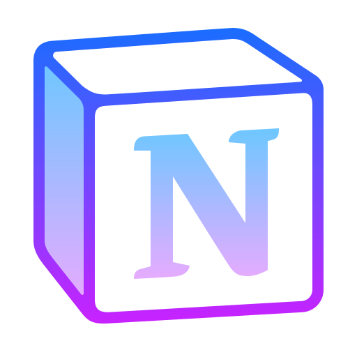
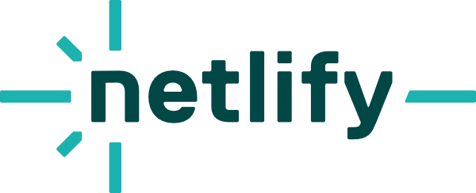
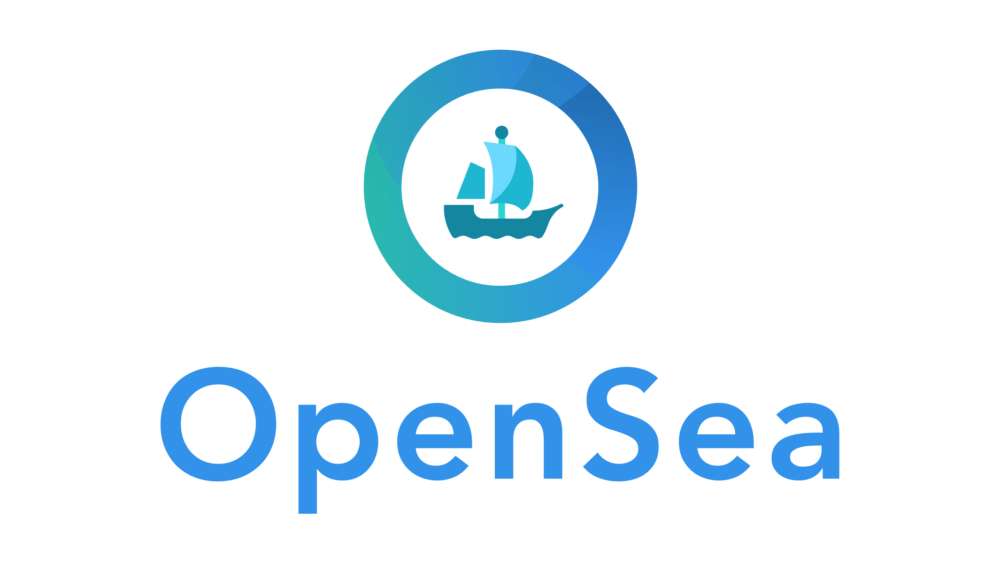
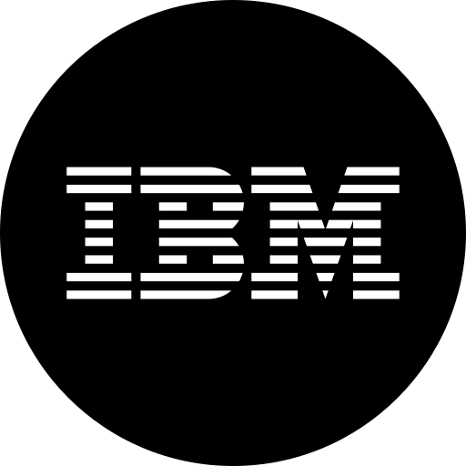

# <b>👋 Hi, I'm Eduardo welcome to my profile:</b> UNDER RENOVATION 
<p align = "center">
  <a href= "https://eduardomm2023.github.io/webpage/" target = "_blank"></img></a>
</p>
<p align = "center">
  
</p>
<br></br>


<h2>Connect with me</h2>
<p align = "center">
  <br>
  <a href = "mailto: mmeduardomartinez@gmail.com?Suject=Aqui%20el%20asunto%20del%20mail" target = "_blank" src="76_GMAIL.png" width = "30px" height = "30px" title = "Write to my email to give me good news.">
    <code></code> 
  </a>
  <a href = "https://www.linkedin.com/in/eduardo-martinez-martin/" target = "_blank">
    <code></code>
  </a>
  <a href = "https://github.com/eduardomm2023" target = "_blank">
    <code></code>
  </a>
  <a href = "https://eduardomm2023.github.io/webpage/" target = "_blank">
    <code></code>
  </a>
  <a href = "https://facebook.com/emartinezmartin" target = "_blank">
    <code></code>
  </a>
</p>

# ✍️ About Me:
Although I am not a Computer Engineer or Telecommunications Engineer or anything like that since I am a Teacher (vocational), and according to my students say...of the “good” ones, because I am different, my classes are motivating, I listen to them, I care about them and I put myself in their place, etc, the technological world in which I have been immersed for many years, I am as passionate about as or more than the educational one.
<br><br>
Unfortunately, as the educational system we have is not what I like for my students and, you cannot change the system, or at least that's what they say, I CHANGE ME.
<br><br>
And that's where we are, in a deep change, intense, sometimes “painful”, sometimes “challenging”, also “disappointing” (why not say it), often “resilient” but always chosen, confident of my possibilities, abilities, skills and with the illusion of a child with new shoes, or as the families of my students tell me ... a child eager to come to my classes.
<br><br>

What a “chapa” (because I am a chatterbox) that I'm saying (I call it “professional de-formation”) but the truth is... I don't care if with this I achieve the goal of getting people to read a little, as it is very much needed. As for reading comprehension or critical capacity, it would be better not to talk about it and much less we are going to “debate” the “understanding between the lines”.
<br><br>
Anyway, to give you a more concise idea about me, since the best thing is ALWAYS a face-to-face meeting, I can say that:
<br><br>
- I have more than 25 years in the teaching sector as a teacher.
<br><br>
- One of my great passions, besides sports, is traveling.
<br><br>
- In addition to having a lot of training and many years of experience, I have enough humility to know that in this fast and changing technological field, I am a “Junior” and as such I present myself to any company to bet on me.
<br><br>
- And why should they bet on me? Simply because I think I can contribute a lot from my “life experiences”.
<br><br>
- I am always willing to learn new concepts, methodologies (e.g., Agile or Scrum, very “fashionable” lately), contents, experiences, ways to improve and recycle both my training and my knowledge, etc.
<br><br>
- I have been responsible for different departments (physical education, ICT, English, primary school, etc) and team leader.
<br><br>
- I am an English teacher, qualified with C1 (Advanced Level) by Cambridge and Oxford.
<br><br>
- Bodybuilding trainer, masseur and osteopath, sports nutritionist, physical trainer of sports teams (especially soccer) and many more.
<br><br>
- I have had my own massage and nutrition company ('Your Time').

Although up to here apparently, all my training and all my “professional-labor” background does not have much to do with Cybersecurity, Blockchain Technology, Web Development, Data Analysis or many other professions that may be related to current technologies, all these areas have served me for several things, among which I particularly highlight three:
<br><br>
- knowing how to work in a team (very popular nowadays, for example in the Agile methodology),
<br><br>
- active listening and
<br><br>
- empathy (knowing how to put yourself in the other's place), something that is being lost by leaps and bounds.

I am currently finishing my second Master's degree in Python programming and development, Data Analysis and Visualization, Machine Learning and Artificial Intelligence.

Anyway, I don't want to steal anyone's time and I thank everyone who reads my profile.

## <b><i>I would be delighted to have an interview with a company that bets on me and the values I can bring, as I am sure I can bring many things.</i></b>

Thank you very much and see you in the “technological” networks.

P.S. I've been around the world and I'm preparing another one if anyone wants to join.<br>


## 🌐 Social Networks:
[](https://facebook.com/https://facebook.com/emartinezmartin/) [](https://linkedin.com/in/https://www.linkedin.com/in/eduardo-martinez-martin) 

# 💻 Tech Stack:
                                                       
<br></br>
  <p align = "center">
  <kbd>
    <kbd>Tools</kbd>
    <br>
    <br>
    
    
    
    
    
    
    <br></br>
    
    
    
    
    
    
    <br></br> 
    
    
    
  </kbd>
  </p>
  <p align = "center">
  <kbd>
    <kbd>Programming Languages</kbd>
    <br>
    <br>
     
     
     
    
    
  </kbd>
  <kbd>
    <kbd>Back-end</kbd>
    <br>
    <br>
    
    
    
    
    
    
    <br></br>
    
  </kbd>
  </p>
  <p align = "center">
  <kbd>
    <kbd>Front-end</kbd>
    <br>
    <br>
    
    
     
    
    
  </kbd>
  <kbd>
    <kbd>Database</kbd>
    <br>
    <br>
    
    
    
  </kbd>
  <kbd>
    <kbd>Data Science & AI</kbd>
    <br>
    <br>
    
    
    
    
    
    
    <br></br>
    
    
    
    
  </kbd>
  </p>
  <p align = "center">
  <kbd>
    <kbd>System, Networking & Deployment</kbd>
    <br>
    <br>
    
    
    
    
    
    
  </kbd>
  <kbd>
    <kbd>Terminal Scripts</kbd>
    <br>
    <br>
    
    
    
  </kbd>
  <kbd>
    <kbd>IDEs</kbd>
    <br>
    <br>
    
    
    
    
    
    
  </kbd>
   <kbd>
    <kbd>Frameworks</kbd>
    <br>
    <br>
    
    
    
    
    
    
    <br></br>
    
    
  </kbd>
  </p>
<br>
</br>

# 🎓I´ve studied with... 💻 Technology Sites:
<div>
  <p align = "center">
    
    
    
    
    
    
    
    
    
    
    
    
  </p>
</div>
<br></br>
<br></br>


#  A small part of....My PROJECTS: UNDER RENOVATION  
<table>
<tr>
<td width = "50%">
<h3 align = "center">Proyecto Final de Máster "SARA" Parte 1</h3>
<div align = "center">
<a href = "Proyecto SARA Bootcamp.pdf" target = "_blank">
</a>
<h3 align = "center">Proyecto Final de Máster "SARA" Parte 2</h3>
<div align = "center">
<a href = "TRABAJOFINAL-DESAFIOCIBER-Proyecto-SARA.pdf" target = "_blank">
</a>
<br>
<p>
<a href = "htttps://...." target = "_blank">

</a>
<a href = "htttps://...." target = "_blank">

</a>
</p>
</div>
</td>
</tr>
</table>
  
# 📊 GitHub Stats: 
  <p align = "center"></p>
  <p align = "center"></p>
  
 


## 🏆 GitHub Trophies:


### ✍️ Random Dev Quote:


### 🔝 Top Contributed Repo:


---
[](https://visitcount.itsvg.in)

## 📺 Latest YouTube Videos

<table>
  <tbody>
<!-- YOUTUBE:START --><tr><td><a href="https://www.youtube.com/watch?v=JdJ2VBbYYTQ"></a></td>
<td><a href="https://www.youtube.com/watch?v=JdJ2VBbYYTQ">Getting the user's location with JavaScript (Geolocation API tutorial)</a><br/>Dec 22, 2020</td></tr>
<tr><td><a href="https://www.youtube.com/watch?v=WZNG8UomjSI"></a></td>
<td><a href="https://www.youtube.com/watch?v=WZNG8UomjSI">Build a Weather App with HTML, CSS & JavaScript</a><br/>Dec 10, 2020</td></tr>
<tr><td><a href="https://www.youtube.com/watch?v=BVX7kZ4GM-g"></a></td>
<td><a href="https://www.youtube.com/watch?v=BVX7kZ4GM-g">Making a Responsive (Birthday) Card with HTML and CSS</a><br/>Dec 1, 2020</td></tr>
<tr><td><a href="https://www.youtube.com/watch?v=gU7b5Vgnalw"></a></td>
<td><a href="https://www.youtube.com/watch?v=gU7b5Vgnalw">How to Create Custom Snippets for Any Language in VS Code</a><br/>Nov 17, 2020</td></tr>
<tr><td><a href="https://www.youtube.com/watch?v=5ecM9n7A_pY"></a></td>
<td><a href="https://www.youtube.com/watch?v=5ecM9n7A_pY">How to Type HTML and CSS Faster with Emmet</a><br/>Nov 10, 2020</td></tr>
<!-- YOUTUBE:END -->
</tbody>
  </table>

[](https://www.youtube.com/c/DevProTips?sub_confirmation=1)

<h4 align="center">
  
```diff
+@ @ @ @ @ @ @ @ @ @ @ @ @ @ @ @ @ @ @ @ @ @ @ @ @ @ @ @+
@@       o o                                           @@
@@       | |                                           @@
@@      _L_L_                                          @@
@@   ❮\/__-__\/❯ Programming isn't about what you know @@
@@   ❮(|~o.o~|)❯  It's about what you can figure out   @@
@@   ❮/ \`-'/ \❯                                       @@
@@     _/`U'\_                                         @@
@@    ( .   . )     .----------------------------.     @@
@@   / /     \ \    | while( ! (succeed=try() ) ) |     @@
@@   \ |  ,  | /    '----------------------------'     @@
@@    \|=====|/                                        @@
@@     |_.^._|                                         @@
@@     | |"| |                                         @@
@@     ( ) ( )   Testing leads to failure              @@
@@     |_| |_|   and failure leads to understanding    @@
@@ _.-' _j L_ '-._                                     @@
@@(___.'     '.___)                                    @@
+@ @ @ @ @ @ @ @ @ @ @ @ @ @ @ @ @ @ @ @ @ @ @ @ @ @ @ @+
```
</h4>
<br>
</br>

# EJEMPLO
## 🚀 **Work Experience** :computer_mouse: :desktop_computer: 

| 💼 Designation |  🏢Organization | ⏰Timeline  |
| :-: | :-: | :-: |
| Cloud DevOps Engineer | [Decimal Tech](https://www.linkedin.com/company/decimaltech/) | Feb 2022 - Present |
| Open source mentor | [GSsoC](https://gssoc.girlscript.tech/) | Mar 2022 - May 2022 |
| Open source mentor | [SWOC](https://swoc.scriptindia.org/) | Nov 2021 - Feb 2022 |
| Open source mentor | [WoC](https://winterofcode.com/) | Nov 2021 - Feb 2022 |
| Web Developer Intern | [Grivaa Capital](https://www.linkedin.com/company/grivaa-capital/) | Jul 2021 - Sep 2021 |


<br>
</br>


<br>
</br>

<!--START_SECTION:waka-->


**🐱 My GitHub Data** 

> 🏆 17,905 Contributions in the Year 2022
 > 
> 📦 9.1 MB Used in GitHub's Storage 
 > 
> 🚫 Not Opted to Hire
 > 
> 📜 240 Public Repositories 
 > 
> 🔑 0 Private Repositories  
 > 
**I'm an Early 🐤** 

```text
🌞 Morning    117 commits    ████░░░░░░░░░░░░░░░░░░░░░   18.57% 
🌆 Daytime    274 commits    ██████████░░░░░░░░░░░░░░░   43.49% 
🌃 Evening    115 commits    ████░░░░░░░░░░░░░░░░░░░░░   18.25% 
🌙 Night      124 commits    █████░░░░░░░░░░░░░░░░░░░░   19.68%

```
📅 **I'm Most Productive on Wednesday** 

```text
Monday       52 commits     ██░░░░░░░░░░░░░░░░░░░░░░░   8.25% 
Tuesday      96 commits     ███░░░░░░░░░░░░░░░░░░░░░░   15.24% 
Wednesday    183 commits    ███████░░░░░░░░░░░░░░░░░░   29.05% 
Thursday     82 commits     ███░░░░░░░░░░░░░░░░░░░░░░   13.02% 
Friday       74 commits     ███░░░░░░░░░░░░░░░░░░░░░░   11.75% 
Saturday     78 commits     ███░░░░░░░░░░░░░░░░░░░░░░   12.38% 
Sunday       65 commits     ██░░░░░░░░░░░░░░░░░░░░░░░   10.32%

```


📊 **This Week I Spent My Time On** 

```text
⌚︎ Time Zone: Asia/Kolkata

💬 Programming Languages: 
Other                    60 hrs 5 mins       ██████████████████████░░░   91.43% 
JavaScript               1 hr 46 mins        ░░░░░░░░░░░░░░░░░░░░░░░░░   2.69% 
HTML                     46 mins             ░░░░░░░░░░░░░░░░░░░░░░░░░   1.18% 
TypeScript               42 mins             ░░░░░░░░░░░░░░░░░░░░░░░░░   1.08% 
EJS                      28 mins             ░░░░░░░░░░░░░░░░░░░░░░░░░   0.73%

🔥 Editors: 
Browser                  60 hrs 4 mins       ██████████████████████░░░   91.4% 
VS Code                  3 hrs 35 mins       █░░░░░░░░░░░░░░░░░░░░░░░░   5.46% 
WebStorm                 2 hrs 3 mins        ░░░░░░░░░░░░░░░░░░░░░░░░░   3.14%

🐱‍💻 Projects: 
JayantGoel001.github.io  36 hrs 10 mins      █████████████░░░░░░░░░░░░   55.05% 
metrics                  27 hrs 10 mins      ██████████░░░░░░░░░░░░░░░   41.36% 
Jupyter-x-Docker         1 hr 48 mins        ░░░░░░░░░░░░░░░░░░░░░░░░░   2.75% 
PyGithub                 31 mins             ░░░░░░░░░░░░░░░░░░░░░░░░░   0.81% 
Unknown Project          1 min               ░░░░░░░░░░░░░░░░░░░░░░░░░   0.04%

💻 Operating System: 
Windows                  65 hrs 43 mins      █████████████████████████   100.0%

```

**I Mostly Code in Python** 

```text
Python                   20 repos            █████░░░░░░░░░░░░░░░░░░░░   20.41% 
Jupyter Notebook         18 repos            ████░░░░░░░░░░░░░░░░░░░░░   18.37% 
C++                      13 repos            ███░░░░░░░░░░░░░░░░░░░░░░   13.27% 
JavaScript               10 repos            ██░░░░░░░░░░░░░░░░░░░░░░░   10.2% 
HTML                     9 repos             ██░░░░░░░░░░░░░░░░░░░░░░░   9.18%

```
<br>
</br>

 Last Updated on 23/06/2022 02:54:40 UTC
<!--END_SECTION:waka-->

<p align="center">
  
  
</p>


### ML/DL 🤖/🧠 :
<br>
<p align='center'>
</img></p>
<br>
<p align='center'>
&nbsp;&nbsp;
&nbsp;&nbsp;
&nbsp;&nbsp;
</p>
<br>


<!--✏️WORDBOARD / 🌐WEBSITE: https://github.com/JessicaLim8/JessicaLim8 --> 
<h2 align="center">
Join the Word Cloud Board :cloud: :pencil2:

### :thought_balloon: <a href="https://github.com/trinib/word-cloud/issues/new?template=addword.md&title=wordcloud%7Cadd%7C%3CINSERT-WORD%3E"><b>Add your name</b></a> to see the word cloud update in real time :rocket:

:star2: Don't like the arrangement? <a href="https://github.com/trinib/word-cloud/issues/new?template=shufflecloud.md&title=wordcloud%7Cshuffle"><b>Regenerate it</b></a> :game_die:

<h3 align="center">
📛Github Usernames📛 
</br> 

<!--📏LINE-->

<p align="center">


</h4>

<br>
</br>

## Embed Real-time Widget in Repo's / Personal README.md within 30s!

For all charming widgets, please [Check it out 👉](https://next.ossinsight.io/widgets?utm_source=github&utm_medium=referral), here are some examples:


| Repository Activity Trends | Collaborative Productivity - Last 28 days |
| ----------- | ----------- |
|||

| Repository Performance Stats - Last 28 days | Active Contributors - Last 28 days |
| ----------- | ----------- |
|||

| Star Geographic Distribution | Star History |
| ----------- | ----------- |
|||

| Company Affiliation | Lines of Code Changes |
| ----------- | ----------- |
|||

| Pull Request Size | Pull Request Lifecycle |
| ----------- | ----------- |
|||

| Currently Working On - Last 28 days | Top Active Contributors - Last 28 Days |
| ----------- | ----------- |
|||

| Repository Annual Ranking | Find More |
| ----------- | ----------- |
||<a href="https://next.ossinsight.io/widgets?utm_source=github&utm_medium=referral">Visit our website</a >|

<br>
</br>


<br>
</br>

<p align ="center">
  
</p>
<br>
</br>
<p align = "center">
  
</p>
<br>
</br>


[An Internal Link to the Beginning](https://github.com/eduardomm2023/eduardomm2023/blob/main/README.md#-hi-im-eduardo-welcome-to-my-profile-under-renovation-)

<!-- Proudly created with GPRM ( https://gprm.itsvg.in ) -->
